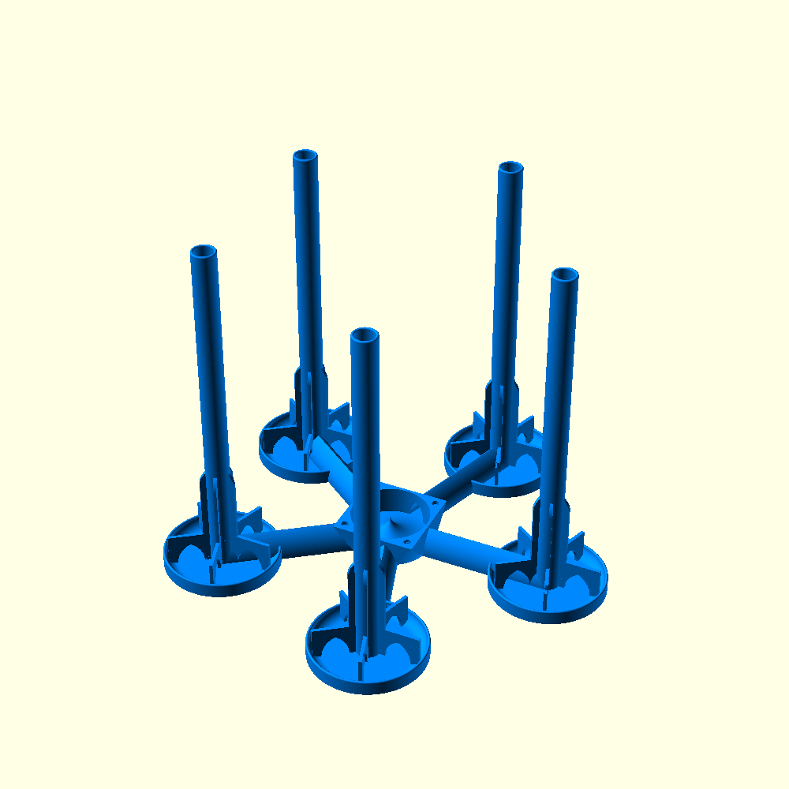

A bottle dryer stand that can be equipped with a PC fan to support drying.

Can be printed without supports -
[GitHub](https://github.com/Mr-Clear/BottleDryerStand) -
[Printables](https://www.printables.com/model/1262046-customizable-bottle-dryer-stand-with-fan) -
[Thingiverse](https://www.thingiverse.com/thing:7006996) -
Made with [OpenSCAD 2025.04.10](https://openscad.org/downloads.html#snapshots)

# Customize
Measure how wide your fattest bottle is, how long your smallest bottle is, how close the bottle neck of your tightest bottle and how wide the opening of your widest bottle is.
## General
### $Fn
Resolution of rendering. The higher the number, the better the quality but also the render time and the file size.
### Part
What shall be rendered:
* __All Together__: The bottle dryer with air caps. This is not meant to be printed.
* __Stand:__ The  whole bottle dryer.
* __Cap:__ Cap to put on unused pipes.

### Wall Thickness
Width of all walls around air chambers. Should be a multiple of your nozzle diameter or slightly above.
### Base Thickness
Height of the ground plate. Has big influence on the stability.
### Stand Count
Number of arms around the fan.
### Stand Distance
Distance between the stands. This determines the maximal bottle width.
### Base type
Type of the ground plate:
* __Separate base for every stand__: Ever arm has it's own small base plate.
* __Common base for all stands__: One big base plate around the whole stand.

## Fan
Defines the dimensions of the fan mount and the air box beneath.
### Fan Diameter
Diameter of the fan. Screw hole distance is automatically determined by the diameter.
### Fan Plate Thickness
Thickness of the plate where the fan is mounted.
### Fan Screw Diameter
Diameter for the screw holes. No thread will be generated.

## Bottle Stand
Defines the dimensions of all the single stands around the fan.
### Bottle Height
Height of the pipe over the support. Should not be longer than your shortest bottles.
### Bottleneck Diameter
Diameter of the bottle neck support. Should not be more narrow than your tightest bottles.
The pipe sectional area will be half the sectional area of the neck.
### Support thickness
Width of the walls where the bottle stands on.
### Support Count
Number of walls where the bottle stands on. More means better support, less means better air flow.
### Support Diameter
Size of the walls where the bottle stands on. Should not be smaller than the opening of your widest bottles.
### Support height
Height of walls where the bottle stands on.

## Cap
The cap is meant to block the air flow for not used pipes.
### Cap Height
Size of the cap.
### Print Accuracy
Backlash that let the cap easily fit on the pipe. This doesn't need to be very tight.